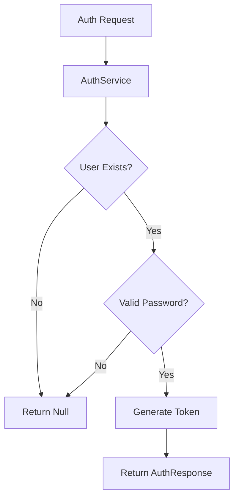
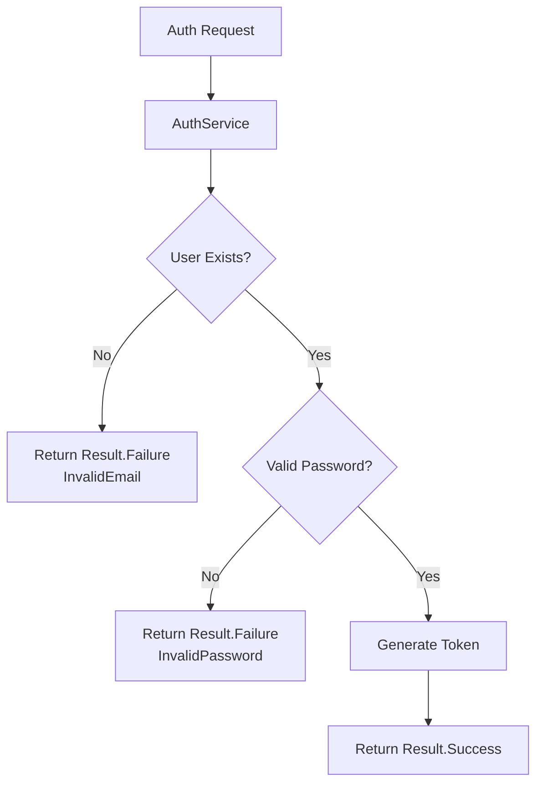

# Implementing Result Pattern in Authentication Service

## Problem Statement

The current authentication implementation has several limitations in error handling:



### Current Limitations

| Component | Issue | Impact |
|-----------|--------|---------|
| AuthService | Returns `null` for failures | No distinction between different error types |
| AuthController | Basic `BadRequest` response | Limited error information for clients |
| Error Handling | No structured approach | Difficult to maintain and extend |

## Solution: Result Pattern

We're implementing the Result pattern to provide better error handling and more detailed feedback.

### Core Components

#### 1. Error Record
```csharp
public record Error(string Code, string Description)
{
    public static readonly Error None = new(string.Empty, string.Empty);
}
```

#### 2. Result Class
```csharp
public class Result
{
    public bool IsSuccess { get; }
    public bool IsFailure => !IsSuccess;
    public Error Error { get; } = default!;
}
```

### Key Features

| Feature | Description | Benefit |
|---------|-------------|----------|
| IsSuccess | Boolean indicating operation success | Clear success/failure state |
| IsFailure | Inverse of IsSuccess | Explicit failure checking |
| Error Property | Contains error details | Detailed error information |
| Error.None | Static instance for success cases | Consistent success representation |

## Implementation Benefits



### Advantages

1. **Type Safety**
   - No more null checking
   - Compiler-enforced error handling

2. **Error Clarity**
   - Distinct error types
   - Detailed error messages
   - Error codes for client handling

3. **Maintainability**
   - Consistent error handling pattern
   - Easy to extend with new error types
   - Clear separation of concerns

## Next Steps

1. Update `AuthService` interface:
   ```csharp
   public interface IAuthService
   {
       Task<Result<AuthResponse>> GetTokenAsync(string email, string password, CancellationToken cancellationToken);
   }
   ```

2. Define authentication-specific errors
3. Implement error handling in controller
4. Add response mapping for client consumption

## Usage Example

```csharp
// Controller implementation
public async Task<IActionResult> LoginAsync([FromBody] LoginRequest request, 
    CancellationToken cancellationToken)
{
    var result = await _authService.GetTokenAsync(
        request.Email, 
        request.Password, 
        cancellationToken);

    return result.IsSuccess 
        ? Ok(result.Value)
        : BadRequest(result.Error);
}
```
