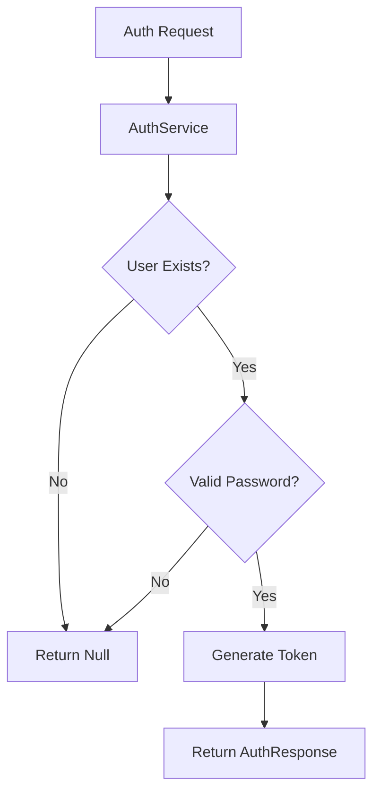
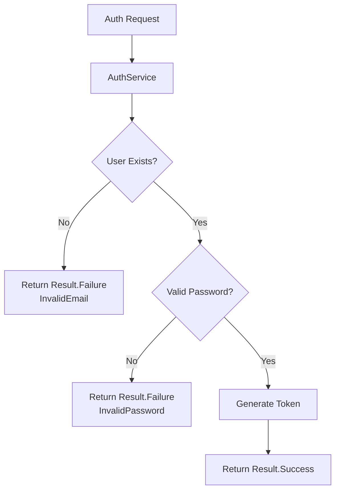
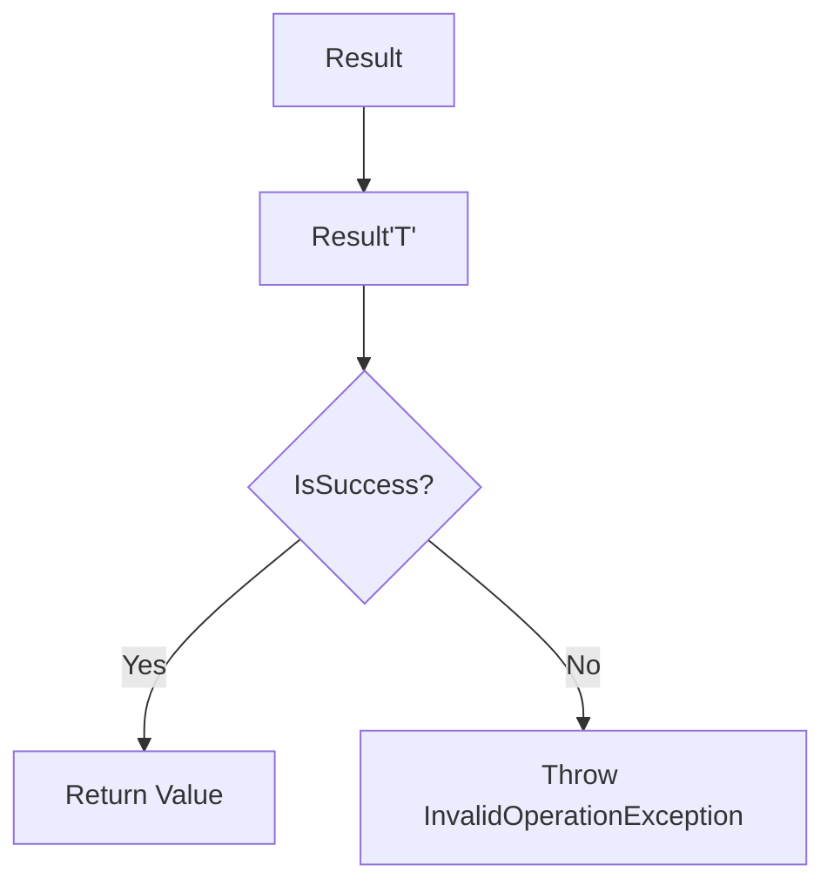
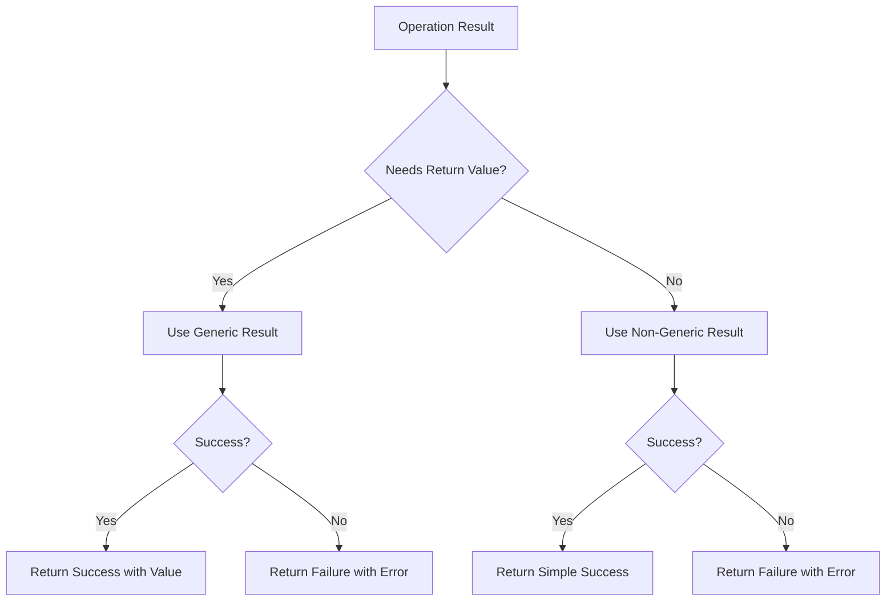
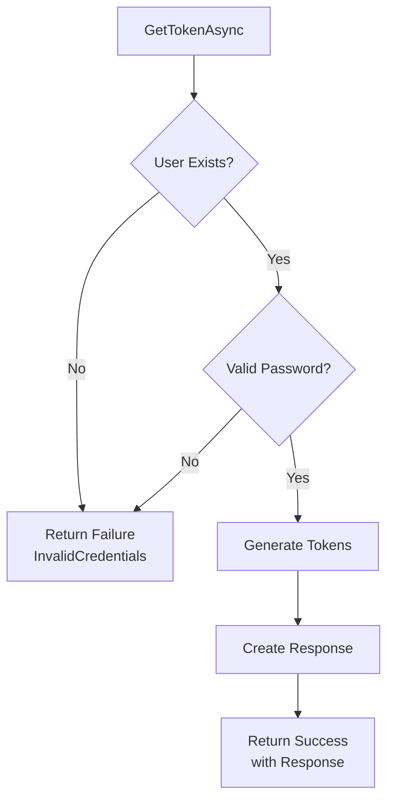
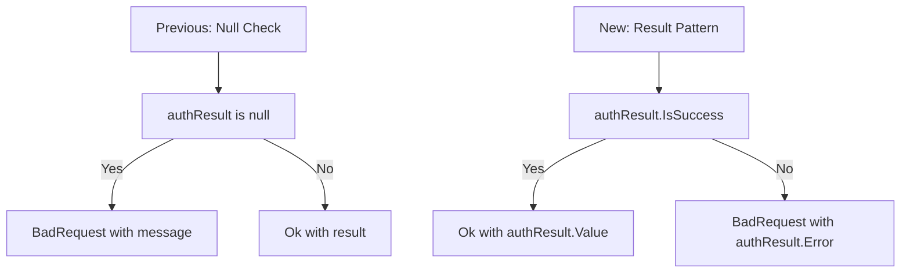

# Implementing Result Pattern in Authentication Service

## Problem Statement

The current authentication implementation has several limitations in error handling:



### Current Limitations

| Component | Issue | Impact |
|-----------|--------|---------|
| AuthService | Returns `null` for failures | No distinction between different error types |
| AuthController | Basic `BadRequest` response | Limited error information for clients |
| Error Handling | No structured approach | Difficult to maintain and extend |

## Solution: Result Pattern

We're implementing the Result pattern to provide better error handling and more detailed feedback.

### Core Components

#### 1. Error Record
```csharp
public record Error(string Code, string Description)
{
    public static readonly Error None = new(string.Empty, string.Empty);
}
```

#### 2. Result Class
```csharp
public class Result
{
    public bool IsSuccess { get; }
    public bool IsFailure => !IsSuccess;
    public Error Error { get; } = default!;
}
```

### Key Features

| Feature | Description | Benefit |
|---------|-------------|----------|
| IsSuccess | Boolean indicating operation success | Clear success/failure state |
| IsFailure | Inverse of IsSuccess | Explicit failure checking |
| Error Property | Contains error details | Detailed error information |
| Error.None | Static instance for success cases | Consistent success representation |

## Implementation Benefits



### Advantages

1. **Type Safety**
   - No more null checking
   - Compiler-enforced error handling

2. **Error Clarity**
   - Distinct error types
   - Detailed error messages
   - Error codes for client handling

3. **Maintainability**
   - Consistent error handling pattern
   - Easy to extend with new error types
   - Clear separation of concerns

## Next Steps

1. Update `AuthService` interface:
   ```csharp
   public interface IAuthService
   {
       Task<Result<AuthResponse>> GetTokenAsync(string email, string password, CancellationToken cancellationToken);
   }
   ```

2. Define authentication-specific errors
3. Implement error handling in controller
4. Add response mapping for client consumption

## Usage Example

```csharp
// Controller implementation
public async Task<IActionResult> LoginAsync([FromBody] LoginRequest request, 
    CancellationToken cancellationToken)
{
    var result = await _authService.GetTokenAsync(
        request.Email, 
        request.Password, 
        cancellationToken);

    return result.IsSuccess 
        ? Ok(result.Value)
        : BadRequest(result.Error);
}
```


# Extending Result Pattern with Generic Support

## Base Result Class Implementation

The base `Result` class provides fundamental success/failure handling:

```csharp
public class Result
{
    protected Result(bool isSuccess, Error error)
    {
        if ((isSuccess && error != Error.None) || (!isSuccess && error == Error.None))
            throw new InvalidOperationException();
        
        IsSuccess = isSuccess;
        Error = error;
    }

    public bool IsSuccess { get; }
    public bool IsFailure => !IsSuccess;
    public Error Error { get; }

    public static Result Success() => new(true, Error.None);
    public static Result Failure(Error error) => new(false, error);
}
```

## Generic Result Implementation

To support returning values with successful results, we implement a generic version:



```csharp
public class Result<TValue> : Result
{
    private readonly TValue? _value;

    protected Result(TValue? value, bool isSuccess, Error error) 
        : base(isSuccess, error)
    {
        _value = value;
    }

    // Returns value if successful, throws exception if failed
    public TValue Value => IsSuccess 
        ? _value! 
        : throw new InvalidOperationException("Failure results cannot have value");
}
```

## Key Features Comparison

| Feature | Base Result | Generic Result<TValue> |
|---------|-------------|----------------------|
| Success State | ✓ | ✓ |
| Error Information | ✓ | ✓ |
| Return Value | ✗ | ✓ |
| Inheritance | N/A | Inherits from Result |

## Example Usage with AuthService

Before:
```csharp
public async Task<AuthResponse?> GetTokenAsync(...)
{
    if (user is null)
        return null; // Limited error information
}
```

After:
```csharp
public async Task<Result<AuthResponse>> GetTokenAsync(...)
{
    if (user is null)
        return Result<AuthResponse>.Failure(new Error("AUTH001", "Invalid email"));

    // On success
    return Result<AuthResponse>.Success(new AuthResponse(
        user.Id,
        user.Email,
        user.FirstName,
        user.LastName,
        token,
        expiresIn,
        refreshToken,
        refreshTokenExpiration
    ));
}
```

## Key Benefits

1. **Type Safety**
   - No null return values
   - Compile-time type checking
   - Clear success/failure states

2. **Error Handling**
   - Structured error information
   - Impossible to access value on failure
   - Clear separation of success and failure paths

3. **Inheritance**
   - Generic Result inherits base Result functionality
   - Maintains consistent behavior
   - Allows for polymorphic usage

## Next Steps
1. Implement static factory methods for Generic Result
2. Update service interfaces to use Result<T>
3. Implement controller response mapping
4. Define domain-specific errors


now lets add the two new methods inside the class result class that both will be generic if we want return values 

public class Result 
 {
  
  public Result (bool isSucess,Error error)
  {
   if((isSucess && error != Error.None) || (!isSuccess && error == Error.None))
      throw new InvalidOpertionException();
   
   IsSuccess= isSuccess;
   Error = error; 
  }
  public bool IsSuccess {get;}
  public bool IsFailure => !IsSuccess;
  public Error Error {get;} = default!;
  


  public static Result Sucess() => new (true,Error.None);
  public static Result Failure(Error error) => new (false,error);

  public static Result<TValue> Success<TValue>(TValue value) => new(value,true,Error.None);   // will need to return value not like the first one that will not retun value
   public static Result<TValue> Success<TValue>(Error error) => new(default,false,error);
 }

so this is the final shape of class result 


# Final Result Pattern Implementation

## Complete Result Class
The final implementation of the Result class includes both non-generic and generic result creation methods:

```csharp
public class Result
{
    protected Result(bool isSuccess, Error error)
    {
        if ((isSuccess && error != Error.None) || (!isSuccess && error == Error.None))
            throw new InvalidOperationException();
        
        IsSuccess = isSuccess;
        Error = error;
    }

    public bool IsSuccess { get; }
    public bool IsFailure => !IsSuccess;
    public Error Error { get; }

    // Non-generic result methods
    public static Result Success() => new(true, Error.None);
    public static Result Failure(Error error) => new(false, error);

    // Generic result methods
    public static Result<TValue> Success<TValue>(TValue value) 
        => new(value, true, Error.None);
    
    public static Result<TValue> Failure<TValue>(Error error) 
        => new(default, false, error);
}
```

## Method Overview

| Method | Type | Parameters | Returns | Usage |
|--------|------|------------|---------|--------|
| `Success()` | Non-generic | None | `Result` | Simple success without data |
| `Failure()` | Non-generic | `Error` | `Result` | Simple failure with error |
| `Success<TValue>()` | Generic | `TValue value` | `Result<TValue>` | Success with data |
| `Failure<TValue>()` | Generic | `Error error` | `Result<TValue>` | Failure for operations returning data |

## Usage Examples

```csharp
// Non-generic usage
Result simpleSuccess = Result.Success();
Result simpleFailure = Result.Failure(new Error("ERR001", "Operation failed"));

// Generic usage
Result<AuthResponse> authSuccess = Result.Success(new AuthResponse(/*...*/));
Result<AuthResponse> authFailure = Result.Failure<AuthResponse>(
    new Error("AUTH001", "Invalid credentials"));
```

## Key Features

1. **Dual Support**
   - Supports both simple success/failure results
   - Supports results with return values

2. **Type Safety**
   - Generic methods maintain type safety
   - Default value for failure cases
   - Compile-time type checking

3. **Error Handling**
   - Consistent error handling across generic and non-generic results
   - Strong validation in constructor
   - Clear separation between success and failure cases

## Common Use Cases



This implementation provides a flexible and type-safe way to handle both simple operations and operations that need to return values, while maintaining consistent error handling across both cases.


# Implementing Result Pattern in AuthService

## Interface Update
First, we update the `IAuthService` interface to use `Result<AuthResponse>`:

```csharp
public interface IAuthService
{
    Task<Result<AuthResponse>> GetTokenAsync(string email, string password, CancellationToken cancellationToken = default);
    Task<AuthResponse?> GetRefreshTokenAsync(string token, string refreshToken, CancellationToken cancellationToken = default);
    Task<bool> RevokeRefreshTokenAsync(string token, string refreshToken, CancellationToken cancellationToken = default);
}
```

## Error Definition
We create a dedicated errors class for User-related errors:

```csharp
// Errors/UserErrors.cs
public static class UserErrors
{
    public static readonly Error InvalidCredentials = new(
        "User.InvalidCredentials",
        "Invalid Email or Password"
    );
}
```

## AuthService Implementation

```csharp
public class AuthService : IAuthService
{
    private readonly UserManager<ApplicationUser> _userManager;
    private readonly IJwtProvider _jwtProvider;
    private readonly int _refreshTokenExpiryDays = 14;

    public AuthService(UserManager<ApplicationUser> userManager, IJwtProvider jwtProvider)
    {
        _userManager = userManager;
        _jwtProvider = jwtProvider;
    }

    public async Task<Result<AuthResponse>> GetTokenAsync(
        string email,
        string password,
        CancellationToken cancellationToken = default)
    {
        var user = await _userManager.FindByEmailAsync(email);
        
        if (user is null)
        {
            return Result.Failure<AuthResponse>(UserErrors.InvalidCredentials);
        }

        var isValidPassword = await _userManager.CheckPasswordAsync(user, password);
        
        if (!isValidPassword)
        {
            return Result.Failure<AuthResponse>(UserErrors.InvalidCredentials);
        }

        var (token, expiresIn) = _jwtProvider.GenerateToken(user);
        var refreshToken = GenerateRefreshToken();
        var refreshTokenExpiration = DateTime.UtcNow.AddDays(_refreshTokenExpiryDays);

        user.RefreshTokens.Add(new RefreshToken 
        { 
            Token = refreshToken, 
            ExpiresOn = refreshTokenExpiration 
        });
        
        await _userManager.UpdateAsync(user);

        var response = new AuthResponse(
            user.Id,
            user.Email,
            user.FirstName,
            user.LastName,
            token,
            expiresIn,
            refreshToken,
            refreshTokenExpiration);

        return Result.Success(response);
    }
}
```

## Key Changes

1. **Return Type**
   - Changed from `Task<AuthResponse?>` to `Task<Result<AuthResponse>>`
   - Removed nullable return type

2. **Error Handling**
   - Created dedicated `UserErrors` class
   - Replaced null returns with `Result.Failure<AuthResponse>`
   - Used standardized error codes and messages

3. **Success Case**
   - Created response object
   - Wrapped in `Result.Success()`

## Flow Diagram



## Benefits
1. **Type Safety**
   - No more null checking
   - Clear success/failure states

2. **Error Management**
   - Centralized error definitions
   - Consistent error messages
   - Reusable error codes

3. **Maintainability**
   - Cleaner code structure
   - Easier to extend
   - Better error tracking


# Updating AuthController for Result Pattern

## Previous Implementation
The controller previously checked for null results:

```csharp
public class AuthController : ControllerBase
{
    private readonly IAuthService _authService;

    public AuthController(IAuthService authService)
    {
        _authService = authService;
    }

    [HttpPost]
    public async Task<IActionResult> LoginAsync(
        [FromBody] LoginRequest request,
        CancellationToken cancellationToken)
    {
        var authResult = await _authService.GetTokenAsync(
            request.Email,
            request.Password,
            cancellationToken);

        return authResult is null 
            ? BadRequest("Invalid Email or Password") 
            : Ok(authResult);
    }
}
```

## Updated Implementation
Now we check the `IsSuccess` property of the Result:

```csharp
public class AuthController : ControllerBase
{
    private readonly IAuthService _authService;

    public AuthController(IAuthService authService)
    {
        _authService = authService;
    }

    [HttpPost]
    public async Task<IActionResult> LoginAsync(
        [FromBody] LoginRequest request,
        CancellationToken cancellationToken)
    {
        var authResult = await _authService.GetTokenAsync(
            request.Email,
            request.Password,
            cancellationToken);

        return authResult.IsSuccess 
            ? Ok(authResult.Value) 
            : BadRequest(authResult.Error);
    }
}
```

## Key Changes



## Comparison

| Aspect | Previous Implementation | New Implementation |
|--------|------------------------|-------------------|
| Check Type | Null check | Success/Failure state |
| Error Response | Static message | Detailed error object |
| Success Response | Full result | Only value property |
| Type Safety | Nullable type | Non-nullable Result |

## Benefits
1. **Better Error Handling**
   - Structured error responses
   - Detailed error information
   - Consistent error format

2. **Cleaner Code**
   - More explicit success/failure states
   - No null checking
   - Clear separation of concerns

3. **Better Response Structure**
   - Success responses only contain relevant data
   - Error responses include error details
   - More consistent API behavior

The new implementation provides better type safety and more detailed error information while simplifying the controller logic.
