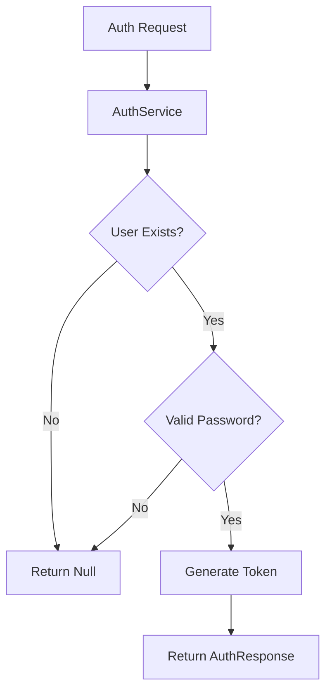
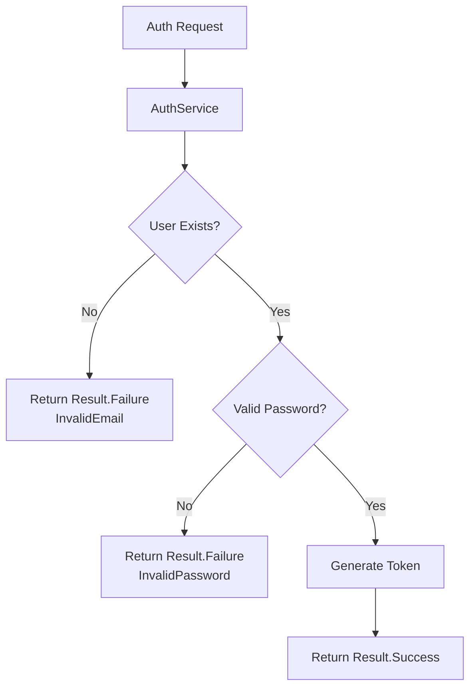
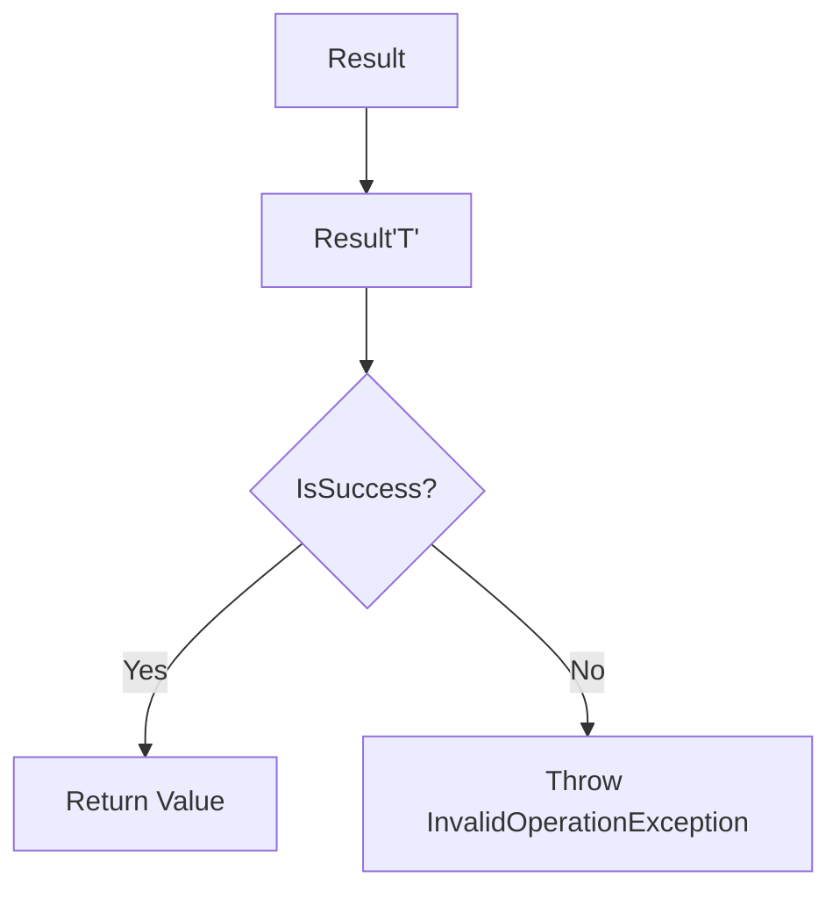

# Implementing Result Pattern in Authentication Service

## Problem Statement

The current authentication implementation has several limitations in error handling:



### Current Limitations

| Component | Issue | Impact |
|-----------|--------|---------|
| AuthService | Returns `null` for failures | No distinction between different error types |
| AuthController | Basic `BadRequest` response | Limited error information for clients |
| Error Handling | No structured approach | Difficult to maintain and extend |

## Solution: Result Pattern

We're implementing the Result pattern to provide better error handling and more detailed feedback.

### Core Components

#### 1. Error Record
```csharp
public record Error(string Code, string Description)
{
    public static readonly Error None = new(string.Empty, string.Empty);
}
```

#### 2. Result Class
```csharp
public class Result
{
    public bool IsSuccess { get; }
    public bool IsFailure => !IsSuccess;
    public Error Error { get; } = default!;
}
```

### Key Features

| Feature | Description | Benefit |
|---------|-------------|----------|
| IsSuccess | Boolean indicating operation success | Clear success/failure state |
| IsFailure | Inverse of IsSuccess | Explicit failure checking |
| Error Property | Contains error details | Detailed error information |
| Error.None | Static instance for success cases | Consistent success representation |

## Implementation Benefits



### Advantages

1. **Type Safety**
   - No more null checking
   - Compiler-enforced error handling

2. **Error Clarity**
   - Distinct error types
   - Detailed error messages
   - Error codes for client handling

3. **Maintainability**
   - Consistent error handling pattern
   - Easy to extend with new error types
   - Clear separation of concerns

## Next Steps

1. Update `AuthService` interface:
   ```csharp
   public interface IAuthService
   {
       Task<Result<AuthResponse>> GetTokenAsync(string email, string password, CancellationToken cancellationToken);
   }
   ```

2. Define authentication-specific errors
3. Implement error handling in controller
4. Add response mapping for client consumption

## Usage Example

```csharp
// Controller implementation
public async Task<IActionResult> LoginAsync([FromBody] LoginRequest request, 
    CancellationToken cancellationToken)
{
    var result = await _authService.GetTokenAsync(
        request.Email, 
        request.Password, 
        cancellationToken);

    return result.IsSuccess 
        ? Ok(result.Value)
        : BadRequest(result.Error);
}
```


# Extending Result Pattern with Generic Support

## Base Result Class Implementation

The base `Result` class provides fundamental success/failure handling:

```csharp
public class Result
{
    protected Result(bool isSuccess, Error error)
    {
        if ((isSuccess && error != Error.None) || (!isSuccess && error == Error.None))
            throw new InvalidOperationException();
        
        IsSuccess = isSuccess;
        Error = error;
    }

    public bool IsSuccess { get; }
    public bool IsFailure => !IsSuccess;
    public Error Error { get; }

    public static Result Success() => new(true, Error.None);
    public static Result Failure(Error error) => new(false, error);
}
```

## Generic Result Implementation

To support returning values with successful results, we implement a generic version:



```csharp
public class Result<TValue> : Result
{
    private readonly TValue? _value;

    protected Result(TValue? value, bool isSuccess, Error error) 
        : base(isSuccess, error)
    {
        _value = value;
    }

    // Returns value if successful, throws exception if failed
    public TValue Value => IsSuccess 
        ? _value! 
        : throw new InvalidOperationException("Failure results cannot have value");
}
```

## Key Features Comparison

| Feature | Base Result | Generic Result<TValue> |
|---------|-------------|----------------------|
| Success State | ✓ | ✓ |
| Error Information | ✓ | ✓ |
| Return Value | ✗ | ✓ |
| Inheritance | N/A | Inherits from Result |

## Example Usage with AuthService

Before:
```csharp
public async Task<AuthResponse?> GetTokenAsync(...)
{
    if (user is null)
        return null; // Limited error information
}
```

After:
```csharp
public async Task<Result<AuthResponse>> GetTokenAsync(...)
{
    if (user is null)
        return Result<AuthResponse>.Failure(new Error("AUTH001", "Invalid email"));

    // On success
    return Result<AuthResponse>.Success(new AuthResponse(
        user.Id,
        user.Email,
        user.FirstName,
        user.LastName,
        token,
        expiresIn,
        refreshToken,
        refreshTokenExpiration
    ));
}
```

## Key Benefits

1. **Type Safety**
   - No null return values
   - Compile-time type checking
   - Clear success/failure states

2. **Error Handling**
   - Structured error information
   - Impossible to access value on failure
   - Clear separation of success and failure paths

3. **Inheritance**
   - Generic Result inherits base Result functionality
   - Maintains consistent behavior
   - Allows for polymorphic usage

## Next Steps
1. Implement static factory methods for Generic Result
2. Update service interfaces to use Result<T>
3. Implement controller response mapping
4. Define domain-specific errors
